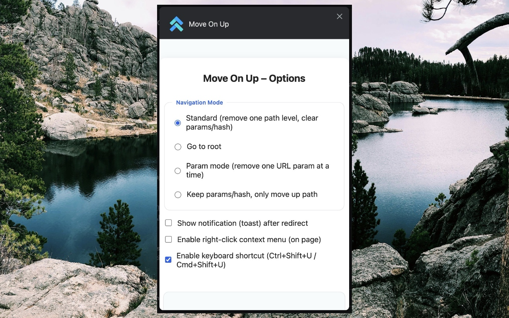

# Move On Up

A modern, smart Chrome & [Firefox](https://addons.mozilla.org/firefox/addon/move-on-up/) extension to "move up" one level in the current tab's URL, with advanced navigation modes, customizable user experience, and a clean, accessible options interface.

---

## 🚀 Features

- **Smart URL Navigation**  
  Move up one level in the URL with a single click or keyboard shortcut, with multiple navigation modes:
  - **Standard**: Remove all query parameters and hash, then remove the last path segment (`/foo/bar?x=1#top` → `/foo`).
  - **Slash-keep**: Remove only the last path segment, keep query and hash.
  - **Root**: Go directly to the site root (`/`), no params or hash.
  - **Param**: Remove one query parameter at a time (right to left), then hash, then last path segment.

- **Options Page**  
  - Modern, responsive UI (vanilla HTML/CSS/JS).
  - Select navigation mode (radio buttons).
  - Enable/disable notifications (toast after redirect).
  - Enable/disable context menu (right-click).
  - Keyboard shortcut info and customization guidance.
  - Instant effect: all options update extension behavior in real time.

- **Context Menu**  
  - Right-click for quick actions:
    - "Move up one level" (current mode)
    - "Go to root"
    - **Quick‑jump list**: every intermediate URL from the deepest path to the root domain (sub‑domains included)
  - Menu visibility is user-configurable.

- **Notifications**  
  - Optional Chrome notification after redirection, showing the new URL.

- **Keyboard Shortcut**  
  - Default: `Ctrl+Shift+U` (Windows/Linux), `Cmd+Shift+U` (Mac).
  - Shortcut is customizable in Chrome extension settings.

- **No Popup**  
  - Clicking the extension icon immediately performs the action (no popup UI).

---

## 📷 Screenshots

---

## 🛠️ Technical Overview

- **Manifest V3**: Secure, modern Chrome extension architecture.
- **Pure JavaScript**: No frameworks, no build step required.
- **chrome.storage.local**: Persistent, instant user preferences.
- **chrome.contextMenus, chrome.notifications, chrome.commands, chrome.action**: Full use of Chrome APIs.
- **Responsive, accessible options page**: Clean, native look and feel.

---

## 📁 File Structure

- **manifest.json**: Extension config, permissions, background, options, commands, icons.
- **background.js**: All navigation, notification, context menu, and shortcut logic.
- **content.js**: (Currently empty, ready for future enhancements.)
- **options/**: Options page UI and logic.
- **assets/**: Extension icon (required: `icon.png` 128x128 or scalable).

---

## 🧑‍💻 Usage

- **Click the extension icon**: Instantly moves up one level in the current tab's URL (according to your selected mode).
- **Keyboard shortcut**:  
  - Windows/Linux: `Ctrl+Shift+ArrowUp`
  - Mac: `Cmd+Shift+ArrowUp`
  - To change: Go to `chrome://extensions/shortcuts`
- **Right-click (context menu)**:  
  - "Move up one level" (current mode)
  - "Go to root"
- **Options page**:  
  - Right-click the extension icon > "Options" or go to `chrome://extensions` > "Details" > "Extension options"
  - Change navigation mode, notifications, context menu instantly.

---

## 📝 Customization

- All options are saved instantly and affect the extension immediately.
- Context menu and notifications can be toggled on/off.
- Navigation mode can be changed at any time.

---

## 🛡️ Permissions

- `tabs`: To update the current tab's URL.
- `storage`: To save user preferences.
- `contextMenus`: For right-click menu actions.
- `notifications`: To show toasts after redirection.
- `commands`: For keyboard shortcut support.

---

## 🧩 Technologies Used

- Chrome Extension Manifest V3
- JavaScript (ES6+)
- HTML5, CSS3 (responsive, accessible)
- Chrome APIs: storage, tabs, contextMenus, notifications, commands, action

---

## 🤝 Contributing

Pull requests are welcome! For major changes, please open an issue first to discuss what you would like to change.

---

## 📄 License

MIT

---

## 🙏 Credits

Created by [onlybets](https://github.com/onlybets).  
Design and logic inspired by user needs for fast, smart URL navigation.
